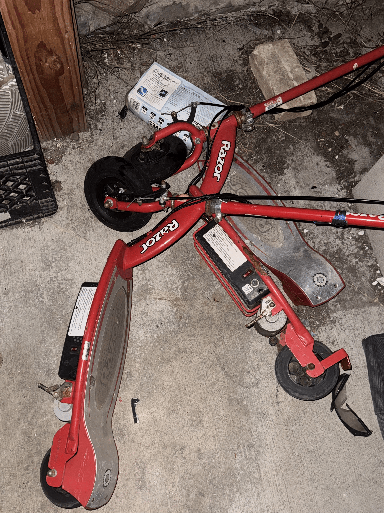
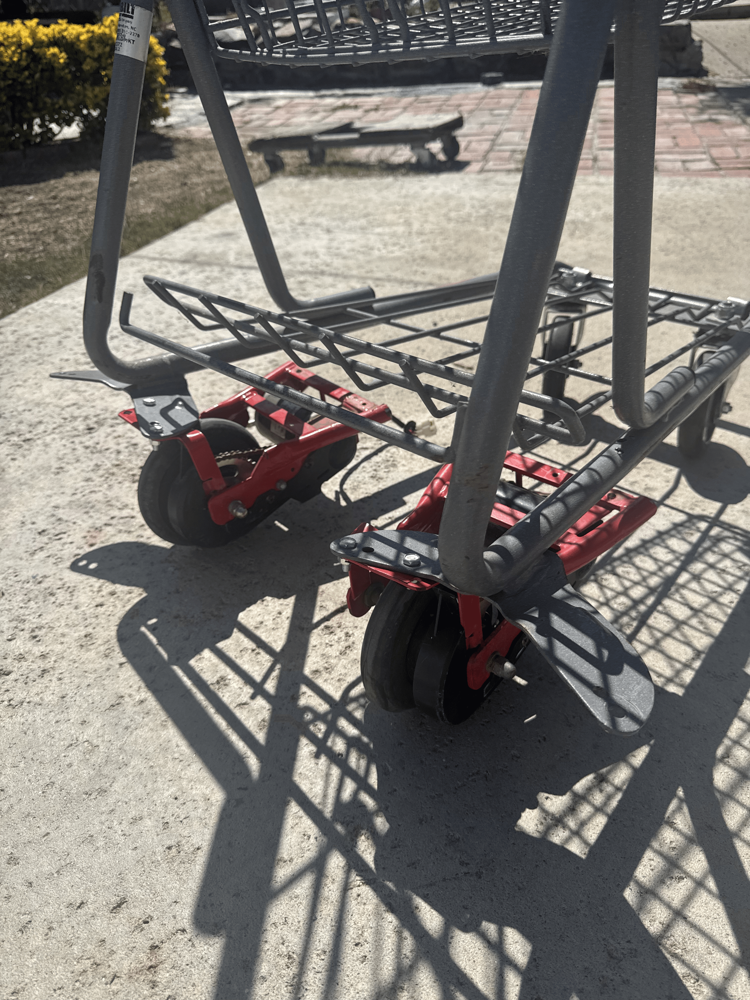
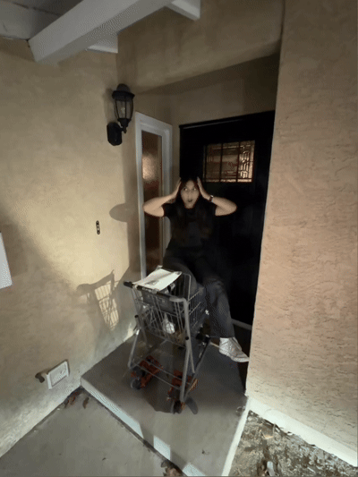

# CLAUDE

*the electric shopping cart*

**Status:** motors attached, not electric yet 😔 \
**Location:** currently at [undisclosed location] 😛

---

## Updates

*in order, from start to now...*

### Update 1 — Politely Borrowing · [08-13-2026]

Copped a lonely shopping cart. 

---

### Update 2 — Parts + Mounting the Motor · [08-17-2026]

Cutting and bending a ton of metal...

  
  

---

### Update 3 — Donated (temporarily) · [09-11-2026]

---

## what's next

- actually get the cart to electronically move
- remote-controlled steering wheel (microcontrollers, raspberry pi, 3d printed parts)
- AI component?? (it is called Claude, after all) 👀
